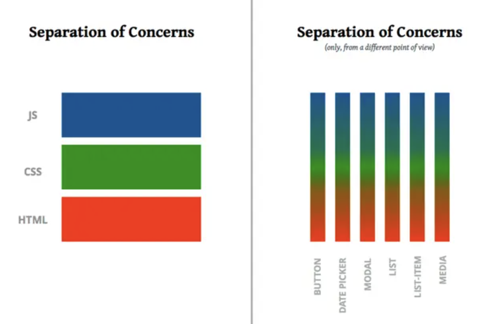

# Chapter 01. 입문자를 위한 지식

[스터디 정리 취합](https://kyoung2.notion.site/250210-1962522077a0803bb12ff32af4ddfdfb?pvs=4)

 
 

# 🎊 복습하기

## 1. 리액트를 만들게 된 동기가 무엇인가요?

### `보경`

\-

### `미림`

웹이 발전하면서 할 수 있는 것들이 많아지자, 더 많은 상태가 더 자주 변경되기 시작했다. 개발자들은 사용자가 새 페이지 렌더링을 기다리지 않고 변경 사항을 즉시 확인할 수 있기를 바랐다. 하지만 기존의 HTML+JS는 대규모 앱을 만들고 대규모 업데이트를 즉각적으로 수행하기엔 한계가 있었다.

개발자들은 대규모 업데이트를 즉각적으로 수행할 수 있으면서, 예측 가능하고 안전하게 개발할 수 있는 기술을 필요로 했다.

이에 리액트가 출시되었으며, 리액트는 선언형 프로그래밍이나 컴포넌트 기반 아키텍처, 단방향 흐름, 가상 DOM 등을 통해 문제를 해결하였다.

### `정욱`

사용자 상호작용에 대해 빠르고 즉각적인 느낌을 주면서도 수백만 명의 사용자를 감당할 정도로 규모가 큰 동시에 안정적으로 작동하는 웹 기반 사용자 인터페이스를 만들기 위해서

### `영은`

\-

 

## 2. 리액트가 MVC와 MVVM 같은 이전 패턴보다 개선된 점은 무엇인가요?

### `보경`

\-

### `미림`

리액트는 컴포넌트 기반 아키텍처와 플럭스 아키텍처를 도입해 MVC, MVVM 패턴을 채용한 리액트 이전 기술에 비해 더욱 “안전하고 예측 가능하게 개발”할 수 있도록 하고, “코드 재사용성과 유지보수성”을 높였다.

- MVC
  - 각 요소 간 강한 결합 ⇒ 유지보수 ↓
  - 규모가 커질수록 컨트롤러가 많아지며 복잡성 ↑
  - 보일러플레이트 코드 多
- MVVM
  - 느슨한 결합 즉, 자유로움으로 MVC 단점 커버
  - 양방향 데이터 흐름 ⇒ 버그 발생 가능성 ↑
  - 보일러플레이트 코드 多 ⇒ 리팩터링, 코드 최적화 어려움
- 리액트
  - 단방향 데이터 흐름 ⇒ 안전 & 예측 가능성 ↑, 버그 발생 가능성 ↓
  - 보일러플레이트 코드 필요 X
  - UI와 UI 관련 로직을 가까이 둘 수 있음 (MVC, MVVM은 관심사 분리로 서로 멀리 떨어짐)

### `정욱`

질문을 살짝 수정할 필요가 있을 듯 함 -> "리액트가 MVC나 MVVM 같은 이전 패턴을 적용한 라이브러리/프레임워크보다 개선된 점" 이라고 하는 게 맞을 듯?

리액트는 단방향 데이터 흐름을 적용하여 기존의 양방향 데이터 흐름을 적용할 때 나타날 수 있는 여러 문제들을 해결하려 함

1. 의도치 않은 부작용 - 뷰가 모델과 동기화되지 않거나 그 반대의 경우!
2. (책에는 없지만) MVC 패턴 형태의 관심사 분리는 실질적인 관심사 분리가 아니라 그저 기술의 분리가 될 수도 있음
   

### `영은`

\-

 

## 3. 플럭스 아키텍처의 특징은 무엇인가요?

### `보경`

\-

### `미림`

- 액션, 디스패처, 스토어, 뷰로 이루어짐
- 단방향 데이터 흐름 ⇒ 예측 가능성
- 여러 데이터의 출처를 스토어로 통일 ⇒ 신뢰성, 안정성
- 테스트 가능성(testability)

### `정욱`

단방향 데이터 흐름을 강조하여 애플리케이션 데이터의 흐름을 더욱 예측 가능하게 만들어줌
Single Source of Truth(SSoT)를 저장하는 Store를 두어, 서로 의존적인 다수의 정보 출처에서 발생할 수 있는 복잡성을 낮춤

### `영은`

\-

 

## 4. 선언적 프로그래밍 추상화의 장점은 무엇인가요?

### `보경`

\-

### `미림`

- 개발자는 보여주고 싶은 것에 초점을 맞추면 됨 (나머지는 생각할 필요가 없음)
- 코드 가독성이 좋음

### `정욱`

How를 기술하기 보다 What을 기술하는 방식으로, 사용자는 원하는 목표만을 작성하면 됨

- 실질적인 처리는 해석기가 담당하게 되어, 일련의 순서에 따라 일어나는 동작을 일일이 신경쓸 필요 없이 원하는 결과를 얻을 수 있음!

### `영은`

\-

 

## 5. 효율적인 UI 업데이트를 위한 가상 DOM의 역할은 무엇인가요?

### `보경`

\-

### `미림`

- 가상 DOM은 실제 DOM을 객체로 표현하는 프로그래밍 개념으로, 컴포넌트 변경 사항 추적을 위해 사용된다. 개발자가 실제 DOM을 조작하지 않아도, 가상 DOM을 통해 UI를 업데이트할 수 있어 안전하다. 가상 DOM을 활용한 UI 업데이트 방식은 다음과 같다.

  - 가상 DOM 생성 → 업데이트 시 새 가상 DOM 생성 → 서로 비교 → 실제 DOM에 필요한 부분만 적용
  - 💬책에서는 가상 DOM에 대해 “변경 사항이 있을 때마다 전체 DOM 트리를 업데이트하는 것보다 빠르고 효율적이다”라고 주장하고 있는데, 실제로도 그럴까? 이에 대한 반론은 많은데 왜 작가는 이렇게 설명했을까?

### `정욱`

- 화면에 표시되어야 하는 HTML 문서의 구조를 나타내는 DOM을 가벼운 형태로 표현한 것
- 업데이트 전후의 가상 DOM을 비교하여, 실제 DOM에 일어날 변경사항을 적용하기 위해 필요한 계산을 효율적으로 알아내기 위한 자료구조
- 최신 리액트 문서에서는 "가상 DOM"이라는 표현을 사용하지 않는 것으로 보이는데, 지금 생각해보면 리액트는 더 이상 웹사이트만을 위한 라이브러리가 아니기 때문에 명칭의 혼동이 있을 수도 있어 제거하지 않았을까...

### `영은`

\-
