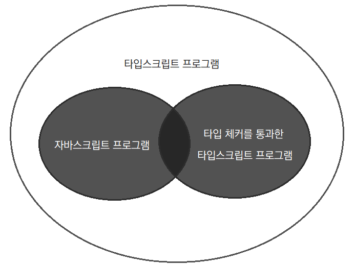

## 📌목표

- 타입스크립트란 무엇인가?
- 타입스크립트와 자바스크립트 간 관계

## 📌타입스크립트와 자바스크립트의 관계 이해하기

### 타입스크립트는 자바스크립트의 상위 집합

타입스크립트는 자바스크립트의 상위 집합(superset)임. 즉 모든 JS는 TS이지만, 그 반대는 아님

- ⇒ .js 파일을 .ts로 바꿔도 달라지는 게 없음
- 타입스크립트가 타입을 명시하는 추가적인 문법을 가지기 때문



### 정적 타입 시스템

- **정적 타입 시스템(TS)**: 타입을 명시해, 런타임 오류를 발생시킬 코드를 **미리** 찾아냄
- 동적 타입 시스템(JS): 코드 실행 시점에 유동적으로 타입을 결정

타입스크립트는 자바스크립트 런타임 동작을 ‘모델링'하며, 런타임 오류를 발생시키는 코드를 찾아내려고 함

- 기본적으로 자바스크립트 런타임 동작에 기반하며, 타입 시스템을 추가함
- 타입 시스템을 통해 런타임 오류를 발생시키는 코드나, 의도와 다르게 동작하는 코드를 찾아냄
- 하지만 모든 오류를 찾아내는 건 아님!
    - **타입 체커는 통과하지만 런타임 오류가 발생하는 코드도 존재**할 수 있음
        
        ```tsx
        const arr = ['Alice', 'Bob'];
        arr[2].toUpperCase(); // 실행 전에 오류를 캐치하지 못함
        ```
        
    - 타입 시스템이 정적 타입의 정확성을 보장해주지 않음
    - 애초에 이런 걸 잡아낼 목적으로 만들어지지 않음

## 📌타입스크립트의 설정 이해하기

### 설정의 다양성

타입스크립트는 설정하기 나름!

커맨드라인 혹은 `tsconfig.json`으로 설정할 수 있음

`tsconfig.json`을 권장 ⇒ 타입스크립트를 어떻게 사용할 것인지 동료나 다른 도구들이 알 수 있음

### 엄격한 타입 체크 설정들

- `noImplicitAny`: 변수들이 미리 정의된 타입을 가져야 하는지 여부
    - `false`로 설정 시, 타입을 명시하지 않았을 때 `any`로 간주함
    - `true`로 설정 시, 타입을 명시하지 않았을 때 오류를 발생시킴 (즉 암시적인 `any`를 비허용)
- `strictNullChecks`: `null`과 `undefined`가 모든 타입에서 허용되는지 여부
- `noImplicitThis`: `this`의 타입이 미리 정의되어야 하는지 여부
- `strictFunctionTypes`: 함수의 매개변수 타입을 엄격히 검사할지 여부
- `strict`: 위 설정들을 모두 적용하여 엄격한 체크를 수행함

## 📌코드 생성과 타입이 관계 없음을 이해하기

### 타입스크립트 컴파일러의 역할

- 최신 TS/JS를 구버전 JS로 트랜스파일 (=코드 생성)
- 코드의 타입 오류를 체크

두 가지는 완벽히 독립적임

### 트랜스파일과 타입 체크는 별개

<aside>
💡

컴파일 과정에서 모든 인터페이스, 타입, 타입 구문은 제거된다.

따라서 컴파일된 결과물을 실행했을 때 타입스크립트 타입 정보는 사용할 수가 없다.

</aside>

- 타입 오류가 있는 코드도 컴파일 가능
- 런타임에는 타입 체크 불가능
    - ❓런타임에 타입 정보를 유지하는 방법
        
        ```tsx
        interface Square {
        	width: number;
        }
        
        interface Rectangle {
        	width: number;
        	height: number;
        }
        
        interface Shape = Square | Rectangle;
        
        // 기존: Rectangle이 타입이기 때문에 런타임 시점에 아무런 역할을 할 수 없음
        if (shape instanceof Rectangle) { ... }
        
        // 방법1: 프로퍼티를 가지고 있는지 여부를 통해 분기
        if ('height' in shape) { ... }
        
        // 방법2: 런타임에 접근 가능한 타입 정보를 명시
        if (shape.kind === 'rectangle') { ... }
        
        // 방법3: 타입을 클래스로 만들어 런타임 시에도 클래스(타입 역할)를 참조 가능하게 함
        class Square { ... }
        class Rectangle { ... }
        
        type Shape = Square | Rectangle; // 여기서 Rectangle은 타입으로 참조되고
        
        if (shape instanceof Rectangle) { ... } // 여기서는 값으로 참조됨
        ```
        
- 타입 연산은 런타임에 영향을 주지 않음
- 런타임 타입은 선언된 타입과 다를 수 있음 (선언한 타입이 언제든지 달라질 수 있다는 걸 명심해야 함)
- 타입스크립트 타입으로는 함수를 오버로드할 수 없음
    
    ```tsx
    function add(a: number, b: number) {…}
    function add(a: string, b: string) {…}
    // 이거 안됨 (C++에서는 가능)
    // 타입과 런타임 동작이 무관하기 때문!
    // 컴파일 시 타입 정보가 제거되면서 두 함수가 같은 함수로 취급될 것임
    ```
    
- 타입으로 인한 빌드타임 오버헤드는 있지만 런타임 오버헤드는 없음

## 📌구조적 타이핑에 익숙해지기

### 자바스크립트는 “덕 타이핑(duck typing)” 기반

덕 타이핑이란, 객체가 어떤 타입에 부합하는 변수와 메서드를 가질 경우 객체를 해당 타입에 속하는 것으로 간주하는 방식이다.

<aside>
💡

ex. 만약 어떤 새가 오리처럼 걷고, 헤엄치고, 꽥꽥 소리를 내면 그 새를 오리라고 부를 것이다~

</aside>

### 타입스크립트의 “구조적 타이핑(structual typing)”

타입스크립트는 자바스크립트의 덕 타이핑 특성때문에 구조적 타입 시스템을 채택했다. 구조적 타이핑은 객체의 구조를 기반으로 타입을 체크하는 방식이다. 그래서 타입이 다르더라도 요구하는 구조를 만족한다면, 타입이 무엇인지 신경쓰지 않는다.

타입스크립트의 구조적 타이핑에 대해 잘 알고 있어야 혼란을 겪지 않을 수 있다. 또 구조적 타이핑의 특징을 잘 활용하면 유연하고 견고한 코드를 작성할 수 있다.

- 예시
    
    ```tsx
    interface Vector2D {
    	x: number;
    	y: number;
    }
    
    // Vector2D 구조에 프로퍼티를 추가한 구조
    // 하지만 Vector2D와 직접적인 관계는 없음
    interface NamedVector {
    	x: number;
    	y: number;
    	name: string;
    }
    
    function calculateLength(v: Vector2D) {
    	return Math.sqrt(v.x * v.x + v.y * v.y);
    }
    
    const v: NamedVector = { x: 3, y: 4, name: 'Zee' };
    calculateLength(v); // v가 Vector2D 타입이 아니지만 정상적으로 호출되어 작동함
    // NamedVector의 구조가 Vector2D 타입과 호환되기 때문임!
    ```
    
- 함수를 작성할 때 매개변수들이 선언된 속성만 가질 거라 생각하기 쉬움(봉인된(sealed), 정확한(precise) 타입). 하지만 타입스크립트 타입 시스템에서 **타입은 항상 열려(open) 있음.**
- 클래스도 구조적 타이핑 규칙을 따르므로 실제 인스턴스와 클래스에 있는 속성들을 가진 객체가 서로 같은 타입(클래스 참조 타입)을 가짐

💬구조적 타이핑이 단점으로 단정지어지지 않는 게 신기…!

## 📌any 타입 지양하기

### any 타입과 타입 시스템 특징 간 관계

타입스크립트의 타입 시스템은 `any` 타입이 있기에 다음 특징을 가짐

- 점진적(gradual): 코드에 타입을 조금씩 추가할 수 있음
- 선택적(optional): 언제든지 타입 체커를 해제할 수 있음

### any 타입의 위험성

`any` 타입을 사용하면 타입스크립트의 장점을 누릴 수 없게 되며, 부득이하게 사용할 경우 위험성을 알고 있어야 함

- `any` 타입에는 타입 안정성이 없음
- `any` 타입은 함수 시그니처를 무시함 (매개변수 타입이 명시되어 있어도, any 타입의 값을 매개변수로 하여 호출할 수 있고 여기에 오류가 발생하지 않음)
- `any` 타입에는 언어 서비스가 적용되지 않음 (자동완성, 도움말 등)
- `any` 타입은 잠재적인 버그를 야기할 수 있음 (타입 체커는 통과하지만 런타임 오류가 발생할 수 있는 코드가 생김)
- `any` 타입으로 더 구체적인 타입을 감춰, 타입 설계와 의도를 가림
- `any`는 타입 시스템의 신뢰도를 떨어뜨림

## 💬느낀 점

- 옮긴이의 말 중, ‘지침서가 될 수는 있지만 절대적 정답은 아니니 비판적으로 생각하라’는 이야기를 명심하면서 읽자
- vs code에서 ‘기호 이름 바꾸기’ 같은 기능이 있는 줄 몰랐다;;; 생각해보면 당연히 있겠지만… `ctrl + F`로 찾고 바꾸고 했었는데 ㄷㄷ
- 책이 아직 1장이지만 읽기 쉽고 친절한 느낌이라 기대가 된다. 또 각 장의 절들을 독립적으로 읽어도 무방하다고 하니, 궁금한 절(아이템)이 있으면 그것부터 읽어봐도 좋을 것 같다.
- 그동안 집합이나 구조적 타이핑, 정적 타입 시스템 등 타입스크립트에 대한 기본적인 개념들을 완전히 이해하지 못했다. 설명을 들어도 기억에 잘 남지 않았다. 그런데 1장에서 예시와 함께 다루고, 추상적인 말들이 있긴 하지만 풀어서 설명하거나 정제해서 말하고 있어서 이해하는 데 도움이 되었다. 그냥 타입을 명시하기 위해 타입스크립트를 사용했었는데, 이번 책을 통해 타입스트립트의 타입 시스템에 대해 더 깊이 이해하고 싶다.
- 타입스크립트를 사용해도 여전히 런타임 오류가 날 수 있다는 점, 타입스크립트가 구조적 타이핑이라는 점을 알게 되었다.
    - 정적 타입을 통해 오류를 방지하거나 타입 간 완전한 일치를 요구하는 (더 엄격한) 타입 언어들과 다른 점이 신기하다. (정욱, 보경님께서 말씀하신, 적당히 엄격하고 적당히 유연한 게 인기의 요인이라는 말에 동감..!)
    - 이전에 이해하지 못했던 경험들이 이해가 되었다(예를 들어 타입스크립트는 런타임 전에 타입을 검사한다고 했는데 런타임 시 오류가 발생해서 ‘뭐지?’하고 생각한 적)
